# Swipe-N-Borrow Android App

Swipe-N-Borrow is an Android app designed to streamline the process of borrowing and lending books, offering a convenient solution for both users and administrators. This app facilitates various operations such as adding, removing, updating books, searching for books, issuing, re-issuing, and returning books. The underlying Cloud Firestore database ensures efficient storage of book and user details. Firebase Cloud Messaging is utilized for real-time notifications, such as approaching return deadlines, fine increments, or the addition of new books. Cloud Functions are employed for continuous monitoring of the database, updating fines, and triggering relevant notifications. The app features a user-friendly and interactive interface.

For a detailed project description and screenshots, please refer to the [project documentation](#project-description-and-screenshots).

## Tools Used

* [Android Studio](https://developer.android.com/studio) : Primary IDE for Android App Development using Java.
* [Cloud Firestore](https://firebase.google.com/products/firestore) : The Database used for storing data in the form of Collections and Documents.
* [Firebase Authentication](https://firebase.google.com/products/auth) : Used to maintain Accounts and perform Login and Signup Actions.

## Contributing
You are welcome to contribute :

1. Fork it ([https://github.com/kfirul/Swipe-N-Borrow/fork](https://github.com/kfirul/Swipe-N-Borrow/fork))
2. Create new branch : `git checkout -b new_feature`
3. Commit your changes : `git commit -am 'Added new_feature'`
4. Push to the branch : `git push origin new_feature`
5. Submit a pull request !

## Future Work
* UI Improvement and Optimization
* New Features/Functionalities
* Generalization for Flexible Usage.
* Login with Google account

## Project Description and Screenshots
### Features
* Simple and minimal Layout Designs.
* Interlinked Activities for different functions.
* Text Views and Toasts for displaying info.
* Interaction with the User with the help of Edit Text Views, Buttons,Card Views, etc.
* Real-time Synchronization with Online Database.
* Security Rules to protect the database from malicious activities.

### Functionalities
**Admin Account :**

* Add new Book to the Library.
* Update details of an existing account.
* Search for a particular Book.

**User Account :**

* Borrow Books.
* return Book.
* Search for a particular Book.

### Screenshots

| 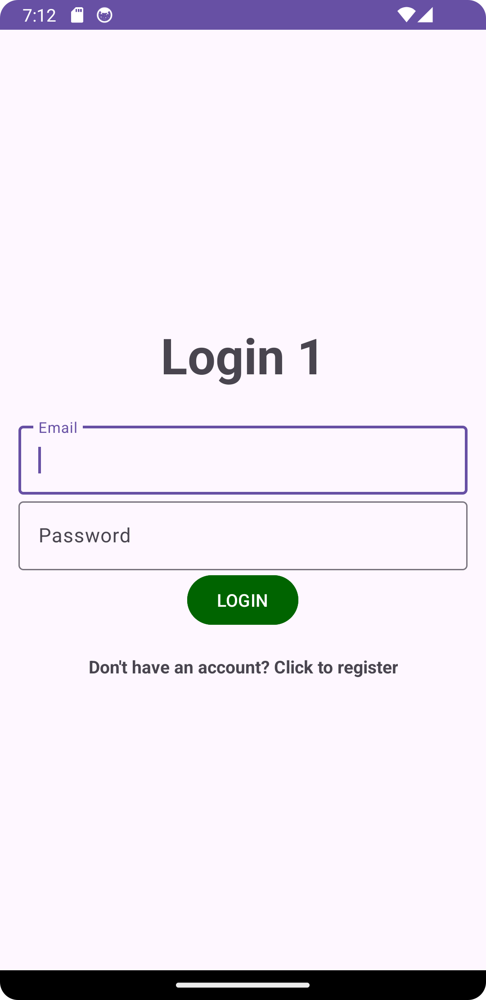 | 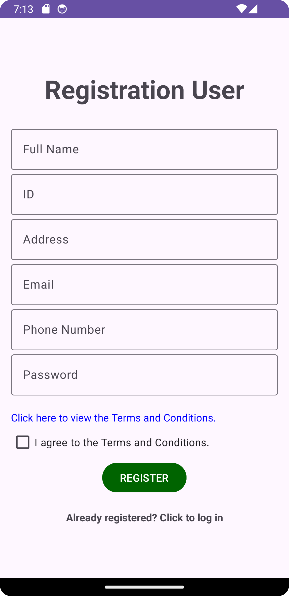 | 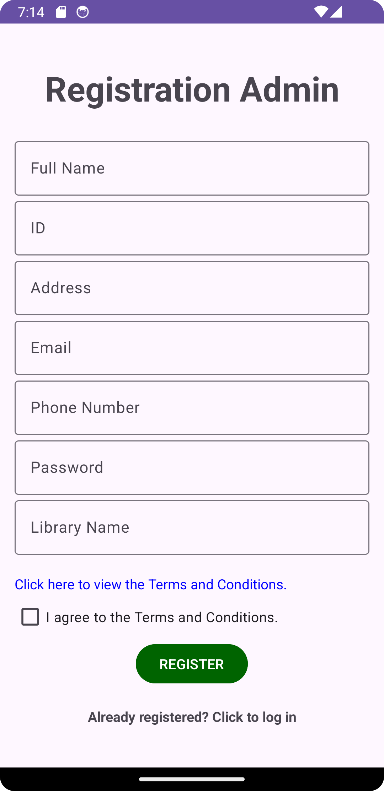 |
|:-------------------------------------------:|:-------------------------------------------------:|:---------------------------------------------------:|
|               **Log In Page**               |            **User Registration Page**             |             **Admin Registration Page**             |

| 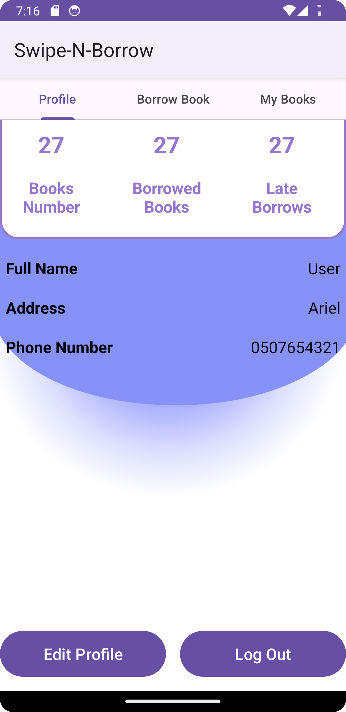 | 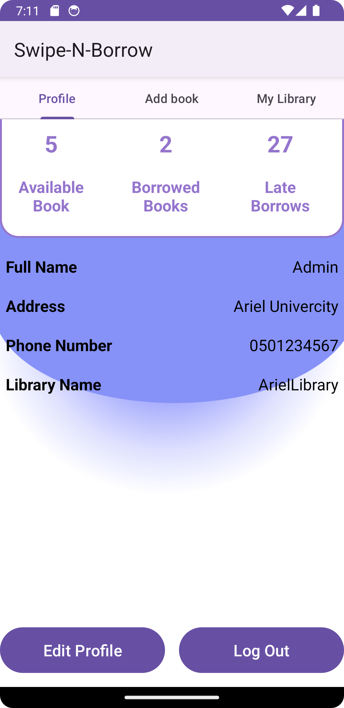 | 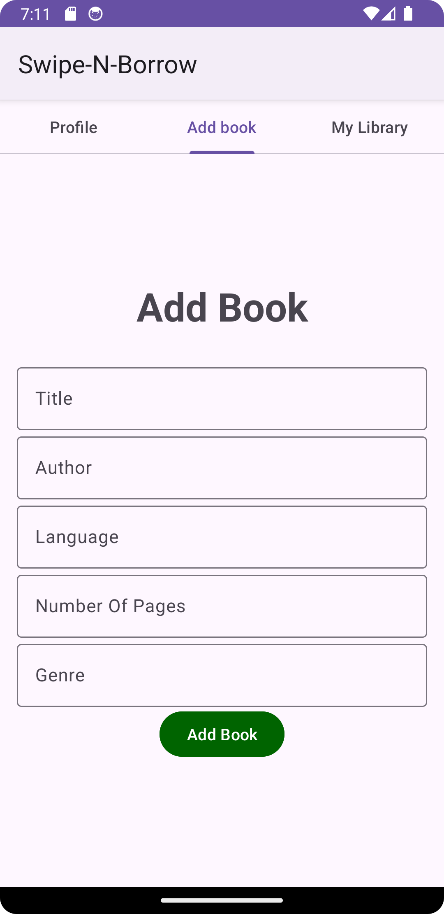 |
|:-------------------------------------------------:|:-------------------------------------------:|:-------------------------------------------------:|
|                **User Home Page**                 |             **Admin Home Page**             |                 **Add Book Page**                 |

| 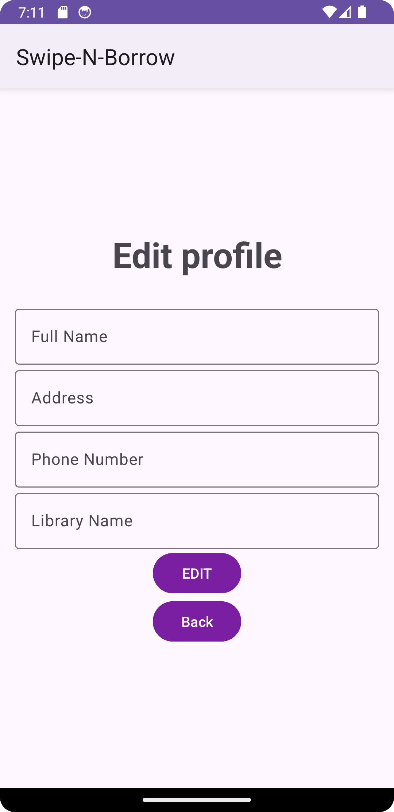 | 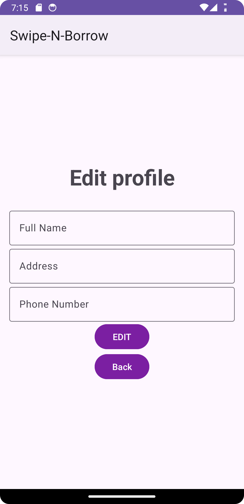 |  |
|:---------------------------------------------------------:|:-------------------------------------------------------:|:-----------------------------------------------:|
|                **Admin Edit Profile Page**                |               **User Edit Profile Page**                |              **Book Search Page**               |

| 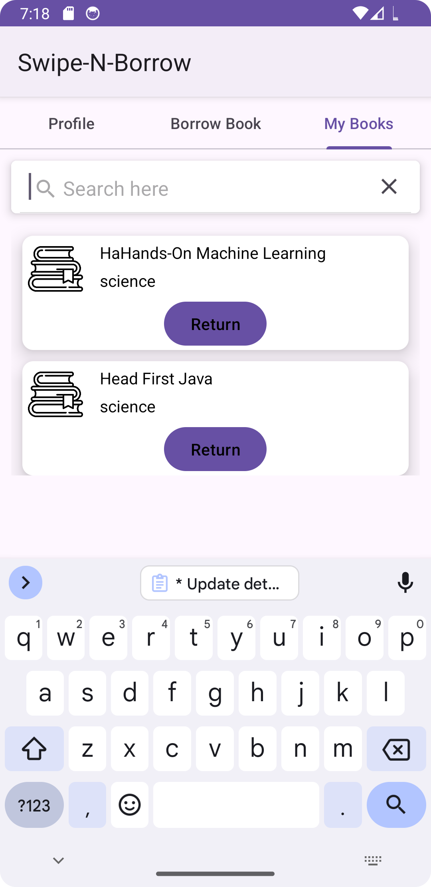 |  |  |
|:-----------------------------------------------:|:-------------------------------------------------------:|:---------------------------------------------------------------:|
|             **User Book List Page**             |                  **User Borrow Book**                   |                    **Choose Register Type**                     |

| 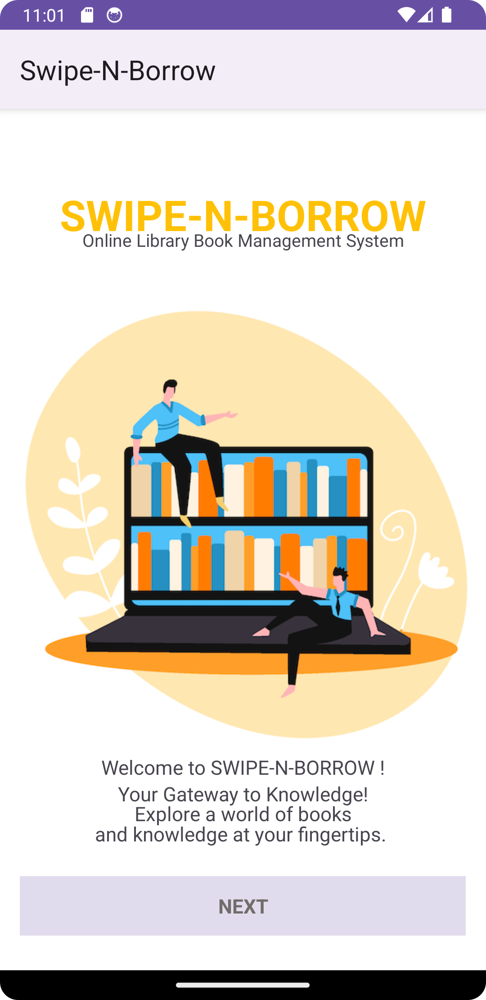 | 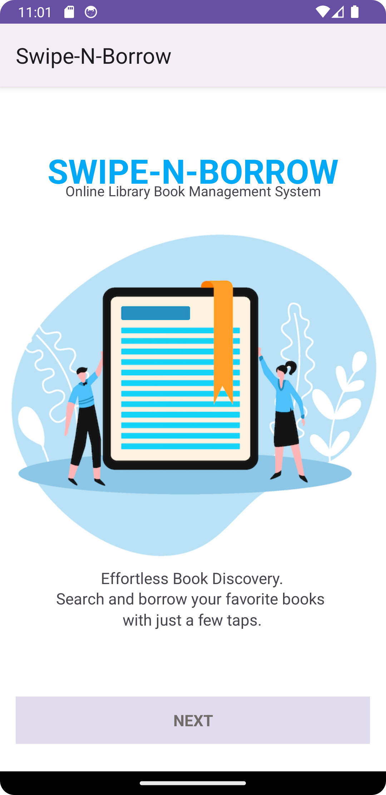 | 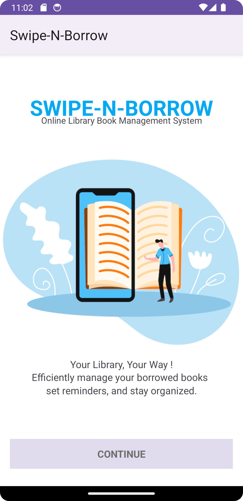 |
|:---------------------------------------:|:---------------------------------------:|:---------------------------------------:|
|        **Introduction Slider 1**         |        **Introduction Slider 2**        |        **Introduction Slider 3**        |

| 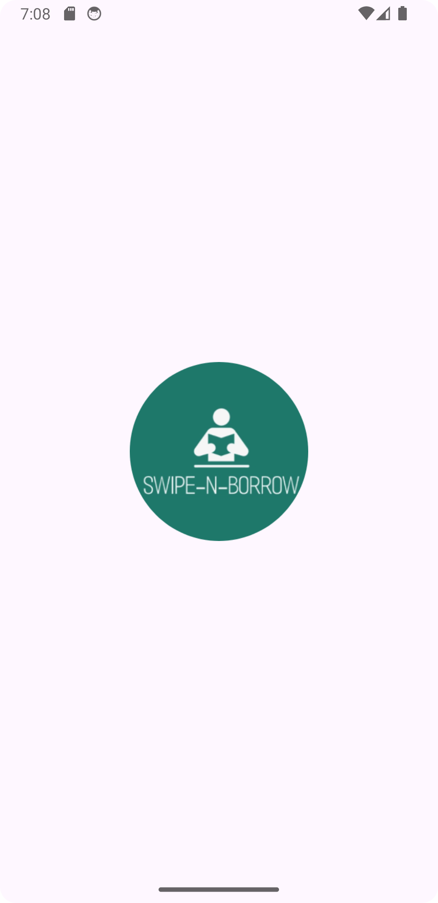 | 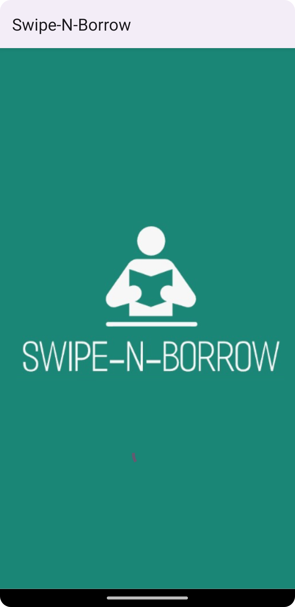 |
|:-----------------------------------------------------:|:-------------------------------------------------:|
|                 **Started App Logo**                  |                 **Splash Screen**                 |

## UML Diagram

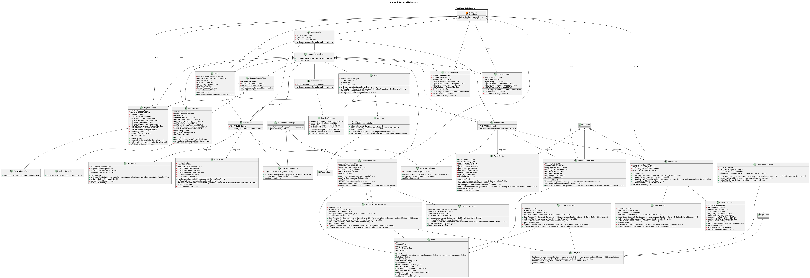

## Final Notes

**Thanks for exploring this repository! Have a great day.**

If you have any queries, feel free to contact us.
